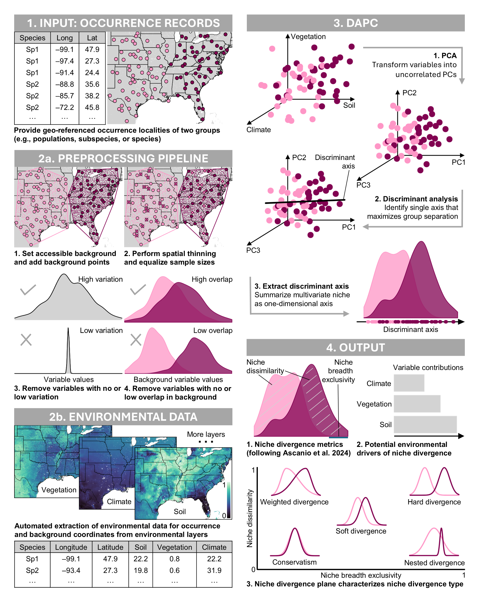
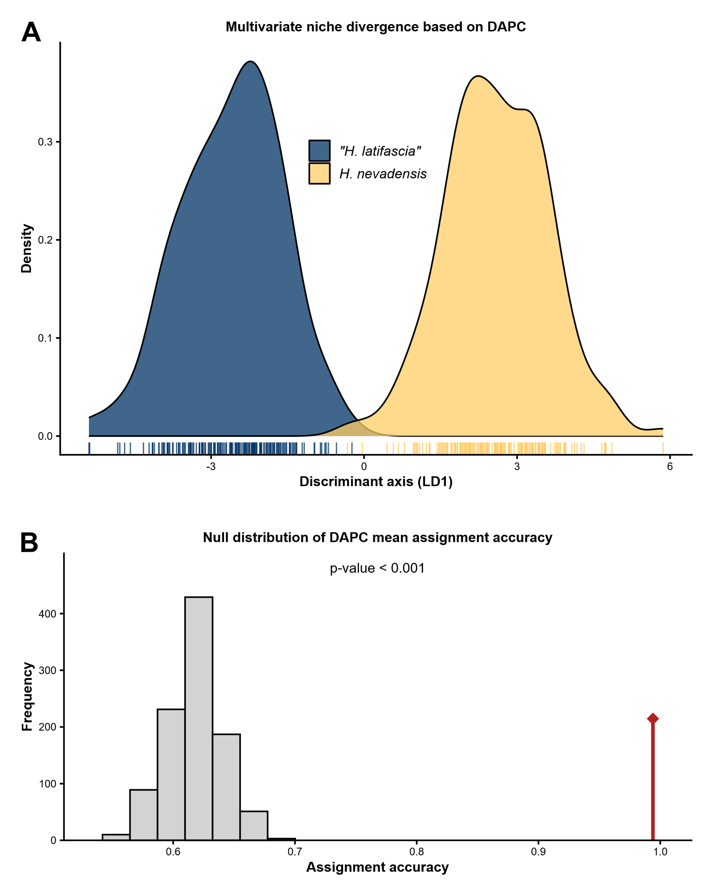
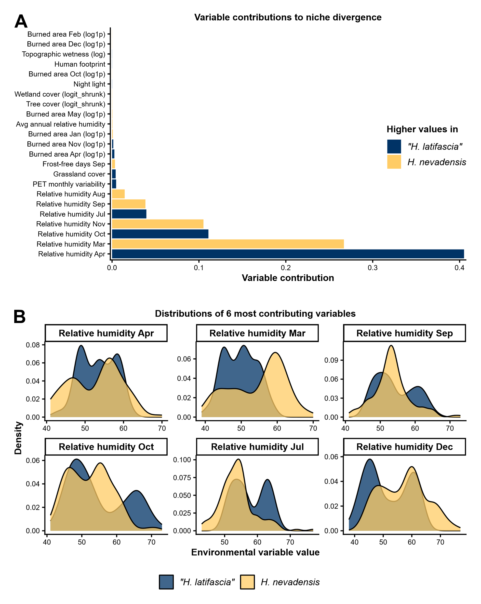
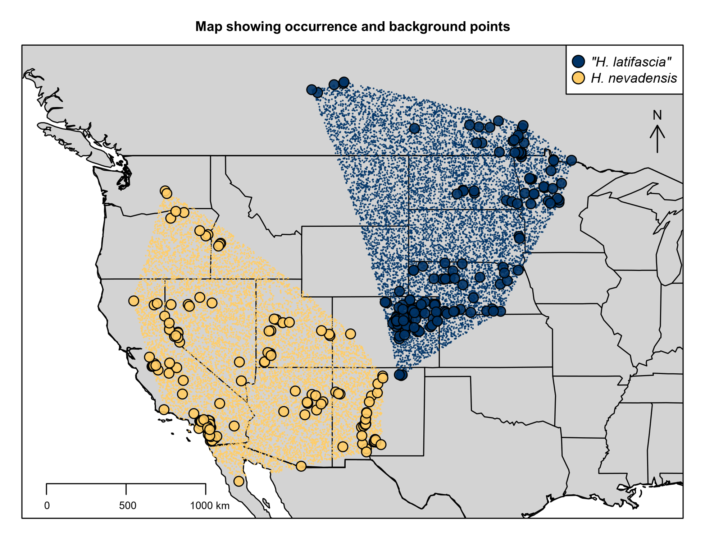

# NicheDiv R package

NicheDiv is an R package for testing pairwise niche divergence across highly multivariate environmental space.

This is done by adapting discriminant analysis of principal components (DAPC) to environmental niche data. Environmental variables are first transformed into principal components (PCs) to reduce dimensionality and collinearity. Discriminant analysis is then used to identify the axis that best separates the two groups. NicheDiv summarizes niche divergence with easily interpretable metrics and density plots.

The idea behind our approach is that ecological niches are highly multidimensional and are rarely captured fully by commonly used annual climate variables alone. Seasonal and monthly variables can capture phenology, resource availability, physiological stress, and other time-dependent ecological processes that may be obscured by annual averages. NicheDiv tackles this problem in two ways: first, by automatically extracting environmental values from a broad set of implemented GIS layers covering both abiotic and biotic environmental dimensions; and second, by making it possible to test niche divergence across this high-dimensional and correlated environmental space using our DAPC-based framework.

## Main advantages of the approach

- Requires only occurrence data as input.
- Automatically extracts environmental values for occurrence records and background points from implemented and user-supplied environmental GIS layers. Implemented GIS layers cover monthly to seasonal climate, topography, phenology, hydrology, vegetation, soil, land cover, and anthropogenic variables (most at global extent).
- Implements a preprocessing pipeline that reduces common biases: delimiting accessible background space, spatially thinning occurrences, balancing sample sizes, filtering low-information variables, and screening predictors for between-group environmental analogy.
- Can handle hundreds of correlated environmental variables.
- Identifies environmental variables contributing most to niche separation.
- Visualizes multivariate niche divergence along a single discriminant axis, making results easy to interpret.
- Can distinguish different forms of niche divergence (weighted, nested, soft, and hard niche divergence)
- Compared with alternative divergence tests, NicheDiv generally retains more variation, and scales more consistently with increasing divergence.

## Development status
The framework is described in a preprint (https://doi.org/10.64898/2026.06.19.733388) and the manuscript is currently in review.  

For bug reports, feedback, or questions, please contact me: daniel.schoenberger@uky.edu.


# Tutorial

## Installation

Install the R package from GitHub and load:

```r
if (!requireNamespace("remotes", quietly = TRUE)) install.packages("remotes")
remotes::install_github("Daniel-1232/NicheDiv")

library(NicheDiv)
```


## Input data

The approach only requires a data frame with occurrence records:

* one row per occurrence record
* unique row names
* longitude and latitude columns
* one grouping column with two (or more) groups to compare

Example:

```r
head(occurrence_data[, c("ID", "Longitude", "Latitude", "Species")])
rownames(occurrence_data) <- occurrence_data$ID
```

```text
     ID Longitude Latitude Species
1 ID_001  -121.50   38.40   Sp1
2 ID_002  -121.75   38.55   Sp1
3 ID_003  -117.25   34.15   Sp2
4 ID_004  -117.10   34.40   Sp2
```

The dataframe can include other columns as long as they are specified under `exclude_cols` (see below).
Groups can be species, population, lineages or any other predefined groupings or clusters.
The dataframe can also include multiple species if you want to perform multiple pairwise comparisons (see section "How to include multiple species" at the end).


## Recommended workflow

The NicheDiv workflow has several major steps. The code below describes the full workflow using recommended default parameters throughout. Parameters that may require tuning are discussed explicitly.

Below is an schematic overview of the niche divergence framework, using two theoretical taxon pairs and three environmental layers as example (figure 1 from Schönberger et al preprint):



## Set working environment and input parameters

Before starting, we need to define all directories, file names and parameters

```r
#### Set working environment and input #########################################

## Set directories
base_dir <- "path/to/project"
results_dir <- file.path(base_dir, "Results")
figure_dir <- file.path(results_dir, "Figure_files")
intermediate_files_dir_name <- "Intermediate_files"


## Set input occurrence file
occurrence_data_file <- file.path(base_dir, "Data/occurrences.csv")


# Set output occurrence files with enviromental data
csv_occurrence_out_file <- "Occurrences_env.csv"
csv_background_out_file <- "Background_env.csv"


## Set parameters and column names
Sp1_name <- "Group_1"
Sp2_name <- "Group_2"
Sp1_label <- "Group 1"
Sp2_label <- "Group 2"

Species_col <- "Species"

Longitude_col <- "Longitude"
Latitude_col <- "Latitude"
CRS_all <- "EPSG:4326"

buffer_km <- 5
base_colors <- c("#A331A3", "#6CB3A5")
exclude_cols <- c("ID", "Locality", "CollectionDate")
```


Use `Sp1_name` and `Sp2_name` for the group names exactly as they appear in the grouping column of your input data frame (e.g., "Hemileuca_nevadensis"), and use `Sp1_label` and `Sp2_label` for the labels displayed in plots (e.g., "H. nevadensis").

`buffer_km` should be chosen to reflect the estimated approximate dispersal distance of the species group.

Use `exclude_cols` to list columns that should be excluded from environmental predictor variables throughout the workflow, such as IDs, locality names, or collection dates.

`CRS_all` defines the coordinate reference system of the occurrence coordinates. Use `"EPSG:4326"` when your longitude and latitude columns are in decimal degrees, which is the most common format for occurrence data. If your coordinates are already projected, provide the corresponding projected CRS instead.

## 1. Extract environmental data and generate background points

We start by extracting environmental values for occurrence records and generate background points within the accessible area.
This is the step which usually takes most time since we need to download all the environmental layers. Fortunately, our approach has minimal GIS layer processing/projecting, saving hours of time and a lot of memory.
In the example below, all implemented environmental datasets are used, which can take several hours. Using all datasets is typically a good approach to describe the niche as comprehensively as possible, but your study system may require excluding datasets that are biologically less relevant.
Furthermore, some datasets are only available for North America (namely, "ClimateNA", "daylength", "snow_water_equivalent").

For terrestrial taxa, we recommend to set `remove.hydrolakes.background = TRUE` which avoids that the background environment includes.

```r
#### Extract environmental data ################################################

## Import occurrences
occurrence_data <- read.csv(occurrence_data_file)

## Extract environmental data and background points
NicheDiv::extract.env.and.background(occurrence.data = occurrence_data,
                                     longitude.col = Longitude_col,
                                     latitude.col = Latitude_col,
                                     generate.background.data = TRUE,
                                     N.background.points = 300000,
                                     buffer.km = buffer_km,
                                     remove.hydrolakes.background = TRUE,
                                     csv.occurrence.out.file = csv_occurrence_out_file,
                                     csv.background.out.file = csv_background_out_file,
                                     output.dir = results_dir,
                                     intermediate.files.dir = intermediate_files_dir_name,
                                     CRS.occurrences = CRS_all,
                                     env.datasets = c("elevation", "ClimateNA", "EVI", "terrain",
                                                      "ENVIREM", "footprint", "landcover", "soil",
                                                      "forest_height", "atmosphere", "nightlight",
                                                      "burned_area", "snow_water_equivalent",
                                                      "daylength", "soil_moisture"))
```

Optional custom rasters can also be supplied by the user as one or more GeoTIFF files:

```r
custom_raster_path <- file.path(base_dir, "Data/custom_environmental_layers.tif")
custom_raster_variable_names <- names(terra::rast(custom_raster_path))

NicheDiv::extract.env.and.background(occurrence.data = occurrence_data,
                                     longitude.col = Longitude_col,
                                     latitude.col = Latitude_col,
                                     generate.background.data = TRUE,
                                     N.background.points = 300000,
                                     buffer.km = buffer_km,
                                     remove.hydrolakes.background = TRUE,
                                     csv.occurrence.out.file = csv_occurrence_out_file,
                                     csv.background.out.file = csv_background_out_file,
                                     output.dir = results_dir,
                                     intermediate.files.dir = intermediate_files_dir_name,
                                     CRS.occurrences = CRS_all,
                                     env.datasets = c("elevation", "ClimateNA"),
                                     custom.env.rasters = custom_raster_path,
                                     custom.env.rasters.variable.names = custom_raster_variable_names)
```

## 2. Import and prepare extracted data

Next, we import and process the extracted environmental data. In this section, no changes in parameters are needed.

```r
#### Import and prepare extracted data #########################################

## Import extracted occurrence and background data
Env_data_occurrences <- read.csv(file.path(results_dir, csv_occurrence_out_file))
Env_data_background <- read.csv(file.path(results_dir, csv_background_out_file), check.names = FALSE)


## Remove metadata columns not used as environmental predictors
Env_data_occurrences <- Env_data_occurrences[, setdiff(colnames(Env_data_occurrences), exclude_cols), drop = FALSE]
Env_data_background <- Env_data_background[, setdiff(colnames(Env_data_background), exclude_cols), drop = FALSE]


## Convert integer columns to numeric
Env_data_occurrences <- NicheDiv::convert.integer.to.numeric(Env_data_occurrences)
Env_data_background <- NicheDiv::convert.integer.to.numeric(Env_data_background)


## Keep the two groups of interest
Env_data_occurrences <- Env_data_occurrences[Env_data_occurrences[[Species_col]] %in% c(Sp1_name, Sp2_name), , drop = FALSE]


## Rename groups for plotting
group_name_map <- setNames(c(Sp1_label, Sp2_label), c(Sp1_name, Sp2_name))
Env_data_occurrences[[Species_col]] <- group_name_map[as.character(Env_data_occurrences[[Species_col]])]
Env_data_occurrences[[Species_col]] <- factor(Env_data_occurrences[[Species_col]], levels = c(Sp1_label, Sp2_label))


## Split occurrence data by group
Sp1_occurrence_data <- Env_data_occurrences[Env_data_occurrences[[Species_col]] == Sp1_label, , drop = FALSE]
Sp2_occurrence_data <- Env_data_occurrences[Env_data_occurrences[[Species_col]] == Sp2_label, , drop = FALSE]
```

## 3. Crop and downsample background data

The next step crops the shared background to a buffered convex hull around each group’s occurrence records and then downsamples each background to the same target size. Only `buffer.method` usually needs to be considered here. This argument defines how the accessible area is buffered around each group’s occurrence records, with larger or more inclusive buffers retaining more background environments and smaller or stricter buffers focusing the comparison on environments closer to the observed occurrences.
Available background geometries are `"hull"`, `"points"`, `"alpha"`, and `"bbox"`. Below we use the convex hull which is usually a robust default. Point buffers or alpha hulls may be useful for fragmented or spatially complex distributions.

```r
#### Prepare background data ###################################################

## Crop background to each group-specific accessible area
Sp1_background_data <- NicheDiv::crop.background.buffered(occurrence.data = Sp1_occurrence_data,
                                                          background.data = Env_data_background,
                                                          CRS = CRS_all,
                                                          buffer.method = "hull",
                                                          buffer.dist.meters = buffer_km * 1000)

Sp2_background_data <- NicheDiv::crop.background.buffered(occurrence.data = Sp2_occurrence_data,
                                                          background.data = Env_data_background,
                                                          CRS = CRS_all,
                                                          buffer.method = "hull",
                                                          buffer.dist.meters = buffer_km * 1000)


## Downsample background data
Sp1_background_data <- NicheDiv::sample.down(Sp1_background_data, N.rows = 10000)
Sp2_background_data <- NicheDiv::sample.down(Sp2_background_data, N.rows = 10000)
```

## 4. Spatially thin and balance occurrence records

To reduce spatial autocorrelation, we thin our occurrence records. A thinning distance (`thinning.dist.km`) of one kilometer is usually an appropriate value, as set below. 
We also downsample both groups to the same number of occurrences (to avoid bias in the discriminant analysis caused by unequal sample sizes).

```r
#### Spatial thinning and sample-size balancing ################################

## Thin occurrence records
Sp1_occurrence_thinned <- NicheDiv::thin.occurrence(Sp1_occurrence_data,
                                                    thinning.dist.km = 1)
Sp2_occurrence_thinned <- NicheDiv::thin.occurrence(Sp2_occurrence_data,
                                                    thinning.dist.km = 1)


## Downsample to equal sample size
n_min_occurrence_thinned <- min(nrow(Sp1_occurrence_thinned), nrow(Sp2_occurrence_thinned))

Sp1_occurrence_thinned <- NicheDiv::sample.down(Sp1_occurrence_thinned,
                                                N.rows = n_min_occurrence_thinned)
Sp2_occurrence_thinned <- NicheDiv::sample.down(Sp2_occurrence_thinned,
                                                N.rows = n_min_occurrence_thinned)
```

## 5. Transform and filter environmental variables

Next, we transform skewed variables and remove variables with low variation.

```r
#### Transform skewed environmental variables ##################################

## Combine occurrence and background datasets
Sp1_Sp2_occurrence_thinned <- rbind(Sp1_occurrence_thinned, Sp2_occurrence_thinned)
Sp1_background_data[[Species_col]] <- Sp1_label
Sp2_background_data[[Species_col]] <- Sp2_label
Sp1_Sp2_background_data <- rbind(Sp1_background_data, Sp2_background_data)


## Transform skewed variables
transformation_results <- NicheDiv::transform.skewed.variables(data.frame = Sp1_Sp2_occurrence_thinned,
                                                               exclude.cols = c(Latitude_col, Longitude_col, Species_col, "ID"),
                                                               background.dataframe = Sp1_Sp2_background_data)
Sp1_Sp2_occurrence_transformed <- transformation_results$transformed
Sp1_Sp2_background_transformed <- transformation_results$background.transformed


## Split transformed data by group
Sp1_occurrence_transformed <- Sp1_Sp2_occurrence_transformed[Sp1_Sp2_occurrence_transformed[[Species_col]] == Sp1_label, , drop = FALSE]
Sp2_occurrence_transformed <- Sp1_Sp2_occurrence_transformed[Sp1_Sp2_occurrence_transformed[[Species_col]] == Sp2_label, , drop = FALSE]

Sp1_background_transformed <- Sp1_Sp2_background_transformed[Sp1_Sp2_background_transformed[[Species_col]] == Sp1_label, , drop = FALSE]
Sp2_background_transformed <- Sp1_Sp2_background_transformed[Sp1_Sp2_background_transformed[[Species_col]] == Sp2_label, , drop = FALSE]
```

```r
#### Remove low-information variables ##########################################
CV_removal_results <- NicheDiv::remove.low.CV.vars(Sp1.occurrence.data = Sp1_occurrence_transformed,
                                                   Sp2.occurrence.data = Sp2_occurrence_transformed,
                                                   Sp1.background.data = Sp1_background_transformed,
                                                   Sp2.background.data = Sp2_background_transformed,
                                                   exclude.cols = c(Latitude_col, Longitude_col, Species_col, "ID"),
                                                   CV.threshold = 0.01)

Sp1_occurrence_filtered <- CV_removal_results$occurrence_Sp1
Sp2_occurrence_filtered <- CV_removal_results$occurrence_Sp2
Sp1_background_filtered <- CV_removal_results$background.Sp1
Sp2_background_filtered <- CV_removal_results$background.Sp2

Sp1_Sp2_occurrence_filtered <- rbind(Sp1_occurrence_filtered, Sp2_occurrence_filtered)
```

Filter to analogous environmental variables:

```r
#### Filter to analogous environmental variables ###############################
Sp1_Sp2_analogous <- NicheDiv::filter.analogous.variables(Sp1.Sp2.occurrence.data = Sp1_Sp2_occurrence_filtered,
                                                          Sp1.background.data = Sp1_background_filtered,
                                                          Sp2.background.data = Sp2_background_filtered,
                                                          exclude.cols = c(Latitude_col, Longitude_col, Species_col),
                                                          CV.threshold = 0.01,
                                                          overlap.threshold = 0.7)
```

This step removes predictors whose background distributions are not sufficiently analogous between groups. This helps reduce bias caused by comparing groups across environmental conditions that are available to one group but not the other.

## 6. Run DAPC and evaluate results

```r
#### Run DAPC niche divergence test ############################################

## Extract group assignments
Sp1_Sp2_species_assignment <- factor(Sp1_Sp2_analogous[[Species_col]])


## Set named group colors
Sp1_Sp2_species_colors <- setNames(base_colors[seq_along(levels(Sp1_Sp2_species_assignment))],
                                   levels(Sp1_Sp2_species_assignment))
Sp1_Sp2_species_assignment <- factor(Sp1_Sp2_species_assignment,
                                     levels = names(Sp1_Sp2_species_colors))


## Run cross-validated DAPC with permutation test
DAPC_results <- NicheDiv::run.DAPC.crossval.permutation(data.input = Sp1_Sp2_analogous,
                                                        species.col = Species_col,
                                                        exclude.cols = c(Latitude_col, Longitude_col),
                                                        N.permutations = 1000,
                                                        N.crossval.replicates = 100)
```

The permutation test compares the observed DAPC assignment accuracy to a null distribution generated by randomly permuting group labels. A significant result indicates that group separation along the discriminant axis is stronger than expected under random group membership.

Calculate niche divergence metrics:

```r
#### Calculate niche divergence metrics ########################################

Niche_divergence_metrics <- NicheDiv::calc.niche.divergence.metrics(DAPC_results,
                                                                    group.assignment = Sp1_Sp2_species_assignment)

Niche_divergence_metrics
```

Optionally, calculate background-weighted metrics:

```r
Niche_divergence_metrics_weighted <- NicheDiv::calc.niche.divergence.metrics(DAPC_results,
                                                                             weight.background = TRUE,
                                                                             Sp1.background.data = Sp1_background_filtered,
                                                                             Sp2.background.data = Sp2_background_filtered,
                                                                             group.assignment = Sp1_Sp2_species_assignment)

Niche_divergence_metrics_weighted
```

The following five niche divergence metrics are calculated:


* `Schoener_D (D)`: niche overlap between the two groups along the discriminant axis. Values range from 0 to 1, where 1 indicates complete overlap and 0 indicates no overlap.
* `Niche_dissimilarity (NDS)`: density-based niche divergence along the discriminant axis. Values range from 0 to 1, where 0 indicates identical occurrence-density distributions and 1 indicates completely non-overlapping densities.
* `Niche_breadth_exclusivity (NE)`: range-based niche divergence along the discriminant axis. Values range from 0 to 1, where 0 indicates completely shared occupied ranges and 1 indicates completely exclusive occupied ranges.
* `Niche_divergence_magnitude (ND)`: combined divergence magnitude in the niche divergence plane. Values range from 0 to 1.41, where 0 indicates no divergence and 1.41 indicates maximum combined density-based and range-based divergence.
* `Niche_divergence_angle (θ)`: relative contribution of density-based versus range-based divergence. Values range from 0° to 90°, where values near 0° indicate divergence mainly driven by range exclusivity, values near 90° indicate divergence mainly driven by density differences within shared space, and intermediate values indicate mixed contributions.

The most important summary metrics are `D` and `ND`. Stronger niche divergence is indicated by lower `D` values and higher `ND` values. As a general rule of thumb: `D` values below 0.4 and `ND` values above 0.9 indicate strong divergence in the current framework.

## Plot DAPC results

Plot the discriminant-axis density distributions:

```r
#### Plot DAPC niche divergence ################################################

NicheDiv::plot.DAPC.niche.divergence(DAPC_results,
                                     group.colors = Sp1_Sp2_species_colors,
                                     save = TRUE,
                                     overwrite = TRUE,
                                     type = "svg",
                                     output.dir = figure_dir,
                                     filename = "DAPC_niche_divergence",
                                     width = 16,
                                     height = 12)
```

Plot the permutation null distribution of classification accuracy (observed value shown as red line):

```r
#### Plot permutation test #####################################################

NicheDiv::plot.DAPC.permutation(DAPC_results,
                                save = TRUE,
                                overwrite = TRUE,
                                type = "svg",
                                output.dir = figure_dir,
                                filename = "DAPC_permutation_test",
                                width = 16,
                                height = 9)
```

Here an example output from the two functions above showing strong multivariate niche divergence (figure 4 from Schönberger et al preprint):



Plot environmental variable contributions:

```r
#### Plot variable contributions ##############################################

DAPC_results_short_names <- DAPC_results
DAPC_results_short_names$dapc_results$var.contr <- NicheDiv::map.env.variable.names(DAPC_results_short_names$dapc_results$var.contr, "short")
DAPC_results_short_names$dapc_results$var.load <- NicheDiv::map.env.variable.names(DAPC_results_short_names$dapc_results$var.load, "short")

DAPC_var_contr <- NicheDiv::plot.DAPC.var.contributions(DAPC_results_short_names,
                                                        group.colors = Sp1_Sp2_species_colors,
                                                        save = TRUE,
                                                        overwrite = TRUE,
                                                        type = "svg",
                                                        output.dir = figure_dir,
                                                        filename = "DAPC_variable_contributions",
                                                        width = 16,
                                                        height = 10)

head(DAPC_var_contr)
```

Plot raw distributions of the top contributing predictors:

```r
#### Plot top predictors #######################################################

Sp1_Sp2_analogous_short_names <- NicheDiv::map.env.variable.names(Sp1_Sp2_analogous, "short")

NicheDiv::plot.top.DAPC.predictors(dapc.results = DAPC_results_short_names,
                                   predictor.data = Sp1_Sp2_analogous_short_names,
                                   species.labels = Sp1_Sp2_species_assignment,
                                   group.colors = Sp1_Sp2_species_colors,
                                   save = TRUE,
                                   overwrite = TRUE,
                                   type = "svg",
                                   output.dir = figure_dir,
                                   filename = "DAPC_top_predictors",
                                   width = 16,
                                   height = 10)
```
Here is an example output from the two variable-contribution plotting functions above (figure 5 from Schönberger et al preprint). The figure summarizes which environmental variables contribute most strongly to the DAPC-based separation of the two taxa in multivariate niche space. Panel A shows the relative contribution of each predictor to the discriminant axis and indicates which species has higher values for each variable. Panel B shows the distributions of the strongest contributing predictors, illustrating how univariate differences in these variables drive the estimated niche divergence. 




Plot occurrences and background points

```r
#### Plot occurrence and background map ########################################

background_labels <- factor(c(rep(levels(Sp1_Sp2_species_assignment)[1], nrow(Sp1_background_data)),
                              rep(levels(Sp1_Sp2_species_assignment)[2], nrow(Sp2_background_data))),
                            levels = levels(Sp1_Sp2_species_assignment))

background_data_combined <- rbind(Sp1_background_data, Sp2_background_data)

NicheDiv::plot.occurrences.map(coordinates = Sp1_Sp2_analogous,
                               group.labels = Sp1_Sp2_species_assignment,
                               group.colors = unname(Sp1_Sp2_species_colors),
                               plot.background.points = TRUE,
                               background.coords = background_data_combined,
                               background.group.labels = background_labels,
                               legend.group.names = c(Sp1_label, Sp2_label),
                               save = TRUE,
                               overwrite = TRUE,
                               type = "svg",
                               output.dir = figure_dir,
                               filename = "Occurrence_background_map",
                               width = 16,
                               height = 12)
```
Here an example map (figure 3 from Schönberger et al preprint); the large points represent occurrence records and the small points background records:



## Optional: Brown and Carnaval-style analogous trimming

In addition to variable-level analogy filtering, NicheDiv includes `trim.to.analogous.environments()` to remove occurrence records from non-analogous environmental conditions following the logic of Brown and Carnaval-style environmental analogy correction.

```r
#### Optional Brown and Carnaval-style correction ##############################

Sp1_Sp2_analogous_trimmed <- NicheDiv::trim.to.analogous.environments(Sp1.occurrence.data = Sp1_occurrence_filtered,
                                                                      Sp2.occurrence.data = Sp2_occurrence_filtered,
                                                                      Sp1.background.data = Sp1_background_filtered,
                                                                      Sp2.background.data = Sp2_background_filtered,
                                                                      exclude.cols = c(Latitude_col, Longitude_col, Species_col),
                                                                      keep.occurrence.cols = c(Latitude_col, Longitude_col, Species_col))
```

The trimmed dataset can then be passed to `run.DAPC.crossval.permutation()` using the same DAPC workflow shown above.

## Optional: run DAPC without analogous-variable filtering

For comparison, users may also run the DAPC test on the filtered occurrence data before analogous-variable filtering. This can help evaluate how much non-analogous environmental space affects the final result.

```r
#### Optional DAPC without analogous-variable filtering ########################

Sp1_Sp2_species_assignment_no_analogy <- factor(Sp1_Sp2_occurrence_filtered[[Species_col]])

Sp1_Sp2_species_colors_no_analogy <- setNames(base_colors[seq_along(levels(Sp1_Sp2_species_assignment_no_analogy))],
                                              levels(Sp1_Sp2_species_assignment_no_analogy))

Sp1_Sp2_species_assignment_no_analogy <- factor(Sp1_Sp2_species_assignment_no_analogy,
                                                levels = names(Sp1_Sp2_species_colors_no_analogy))

DAPC_results_no_analogy <- NicheDiv::run.DAPC.crossval.permutation(data.input = Sp1_Sp2_occurrence_filtered,
                                                                   species.col = Species_col,
                                                                   exclude.cols = c(Latitude_col, Longitude_col),
                                                                   N.permutations = 1000,
                                                                   N.crossval.replicates = 100)

Niche_divergence_metrics_no_analogy <- NicheDiv::calc.niche.divergence.metrics(DAPC_results_no_analogy,
                                                                               group.assignment = Sp1_Sp2_species_assignment_no_analogy)
```

## Main functions

| Function                           | Purpose                                                                          |
| ---------------------------------- | -------------------------------------------------------------------------------- |
| `extract.env.and.background()`     | Extract environmental variables and generate background data.                    |
| `convert.integer.to.numeric()`     | Convert integer columns to numeric.                                              |
| `crop.background.buffered()`       | Crop background points to buffered accessible areas.                             |
| `sample.down()`                    | Downsample occurrence or background records.                                     |
| `thin.occurrence()`                | Spatially thin occurrence records and evaluate residual spatial autocorrelation. |
| `transform.skewed.variables()`     | Transform skewed environmental variables.                                        |
| `remove.low.CV.vars()`             | Remove variables with low coefficient of variation.                              |
| `filter.analogous.variables()`     | Retain predictors with analogous background distributions.                       |
| `trim.to.analogous.environments()` | Remove occurrence records from non-analogous environmental conditions.           |
| `run.DAPC.crossval.permutation()`  | Run cross-validated DAPC and permutation testing.                                |
| `calc.niche.divergence.metrics()`  | Calculate Schoener’s D and niche divergence plane metrics.                       |
| `plot.DAPC.niche.divergence()`     | Plot density distributions along the DAPC discriminant axis.                     |
| `plot.DAPC.permutation()`          | Plot the permutation null distribution.                                          |
| `plot.DAPC.var.contributions()`    | Plot variable contributions to the discriminant axis.                            |
| `plot.top.DAPC.predictors()`       | Plot raw distributions of top contributing predictors.                           |
| `plot.occurrences.map()`           | Plot occurrence and background records on a map.                                 |
| `map.env.variable.names()`         | Convert environmental variable names to shorter or more readable labels.         |


## Citation

Please cite the NicheDiv framework as follows:

Schönberger, D., MacDonald, Z. G., Schmidt, B. C., & Dupuis, J. R. NicheDiv: A DAPC framework to quantify niche divergence across highly multivariate environmental space. bioRxiv. https://doi.org/10.64898/2026.06.19.733388 


## License

NicheDiv is released under the MIT License. See the `LICENSE` file for details.
